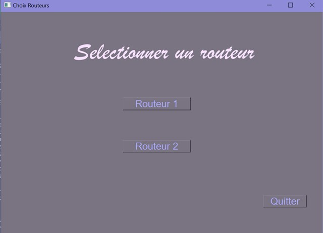
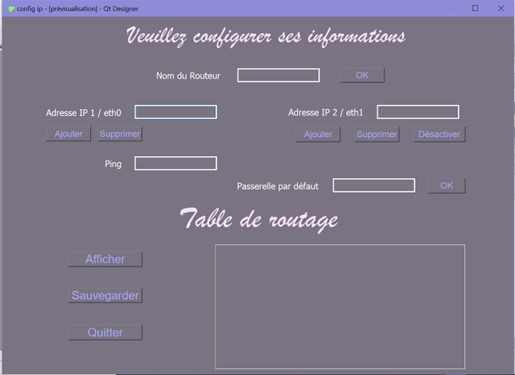

# Interface de configurations des routeurs Cisco

## But du projet
Développer une interface graphique d'utilisateur (GUI) permettant la configuration des routeurs Cisco dans un réseau.  
Ce projet a pour but d'éviter les configurations via ligne de commande, en offrant une interface plus intuitive à l'utilisateur.

## Technologies utilisées
* Paramiko pour l'accès SSH
* MVC 
* QtDeisgner + PyQT pour le développement graphique

## Développement de mon interface graphique sur QtDesigner
Mon interface se compose de 2 pages  
* 

  

* 

  

